# HSK1

## Sources

- **HSK1 Standard Course**, Beijin language and culture university press, *Jiang Liping, Wang Fang, Wang Feng, Liu Liping*
- [Stroke Order Project](https://commons.wikimedia.org/wiki/Commons:Stroke_Order_Project), Images/animations under CC + GFDL, [M4RCo](https://commons.wikimedia.org/wiki/User:M4RC0)
- [Yabla](https://chinese.yabla.com)

## Lesson 1 : 你好

### Pronouns

| 汉子 | 拼音   | 英文                                                         | Stroke order               |
| ---- | ------ | ------------------------------------------------------------ | -------------------------- |
| 我   | wǒ     | I, me, my                                                    | 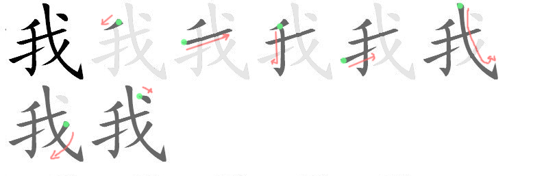 |
| 你   | nǐ     | You (informal)                                               | 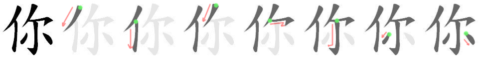 |
| 心   | xīn    | heart, mind, intention, center                               | 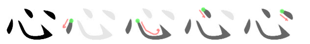 |
| 您   | nín    | You (formal)                                                 | 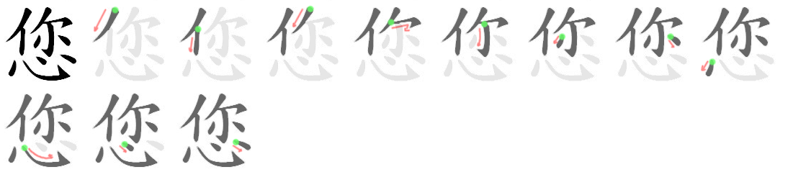 |
| 他   | tā     | He, him                                                      | 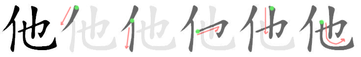 |
| 她   | tā     | She                                                          | 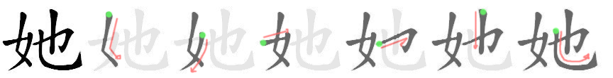 |
| 们   | men    | Plural marker for pronouns, and nouns referring to individuals | 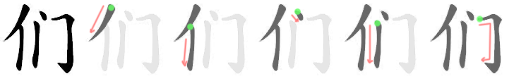 |
| 我们 | wǒ men | We, us, ourselves, our                                       |                            |
| 你们 | nǐ men | You (plural)                                                 |                            |
| 他们 | tā men | They                                                         |                            |
| 她们 | tā men | They, them (for females)                                     |                            |

### Hello

| 汉子   | 拼音       | 英文           | Stroke order               |
| ------ | ---------- | -------------- | -------------------------- |
| 好     | hǎo        | Good, well     | 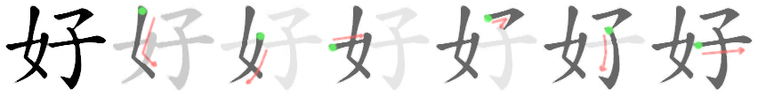 |
| 你好   | nǐ hǎo     | Hello          |                            |
| 您好   | nín hǎo    | Hello (polite) |                            |
| 你们好 | nǐ men hǎo | Hello (plural) |                            |

### I'm sorry. It's okay.

| 汉子   | 拼音        | 英文                                                         | Stroke order               |
| ------ | ----------- | ------------------------------------------------------------ | -------------------------- |
| 对     | duì         | right, correct                                               | 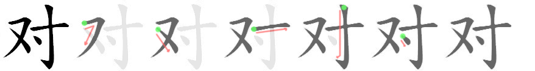 |
| 不     | bù          | negative prefix, not, no                                     | 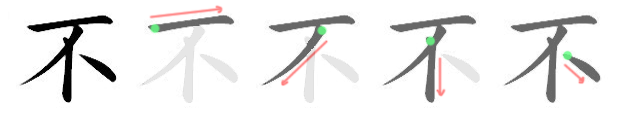 |
| 起     | qǐ          | to rise, to raise, to get up, to start                       | 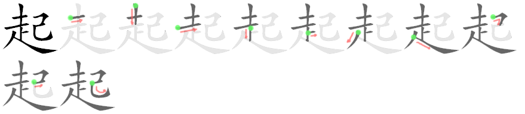 |
| 对不起 | duì bu qǐ   | I'm sorry, excuse me, sorry ?                                |                            |
| 没     | méi         | Negative prefix for verbs, have not, not                     | 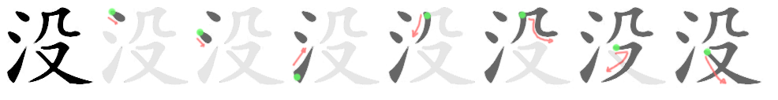 |
| 关     | guān        | mountain pass, to close, to shut, to turn off, to concern, to involve | 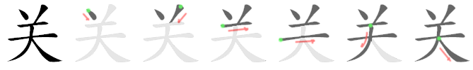 |
| 系     | xì          | to connect, to relate to, to tie up                          | 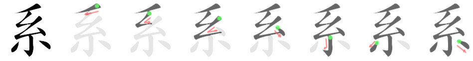 |
| 关系   | guān xì     | relation, relationship, to concern, to affect, to have to do with |                            |
| 没关系 | méi guān xi | It's okay, it doesn't matter                                 |                            |

### Numbers

| 汉子 | 拼音 | 英文  | Stroke order               |
| ---- | ---- | ----- | -------------------------- |
| 一   | yī   | one   | 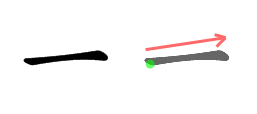 |
| 二   | èr   | two   | 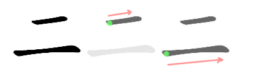 |
| 三   | sān  | three | 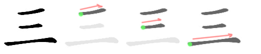 |
| 四   | sì   | four  |  |
| 五   | wǔ   | five  | 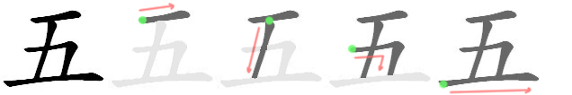 |
| 六   | liù  | six   |  |
| 七   | qī   | seven | 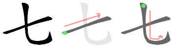 |
| 八   | bā   | eight |  |
| 九   | jiǔ  | nine  | 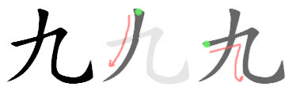 |
| 十   | shí  | ten   | 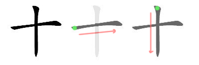 |

## Lesson 2 : 谢谢你

| 汉子 | 拼音 | 英文                                                         | Stroke order               |
| ---- | ---- | ------------------------------------------------------------ | -------------------------- |
| 小   | xiǎo | small, tiny, few, young                                      | 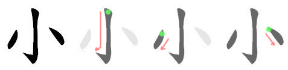 |
| 口   | kǒu  | mouth, classifier for people, domestic animals, cannons, wells | 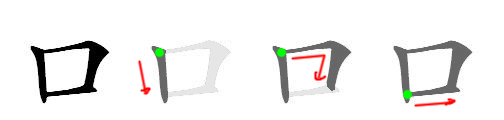 |
| 山   | shān | mountain, hill, anything that resembles a mountain           | 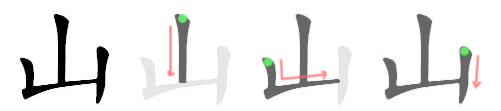 |

### Thank you, bye!

| 汉子   | 拼音       | 英文                                                         | Stroke order               |
| ------ | ---------- | ------------------------------------------------------------ | -------------------------- |
| 谢     | xiè        | to thank, to apologize, to decline                           | 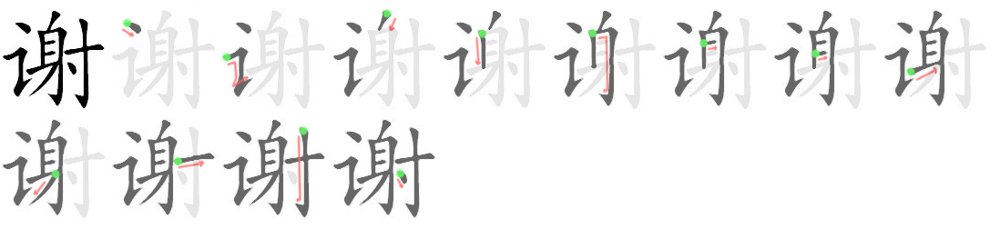 |
| 谢谢   | xiè xie    | to thank, thanks, thank you                                  |                            |
| 不谢   | bù xiè     | don't mention it, not at all, you're welcome                 |                            |
| 谢谢你 | xiè xie nǐ | thank you                                                    |                            |
| 客     | kè         | customer, visitor, guest                                     | 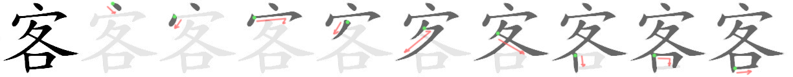 |
| 气     | qi         | air, gas, smell, weather, to make angry, to annoy            | 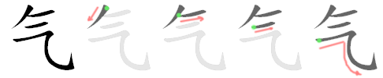 |
| 不客气 | bù kè qi   | don't mention it, my pleasure, you're welcome, don't be so polite |                            |
| 再     | zài        | again, once more, re-, second, another                       | 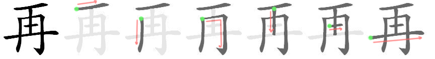 |
| 见     | jiàn       | to see, to meet, to appear                                   |                            |
| 再见   | zài jiàn   | goodbye, see you again later                                 |                            |

### Family members

| 汉子   | 拼音      | 英文                                    | Stroke order               |
| ------ | --------- | --------------------------------------- | -------------------------- |
| 妈妈   | mā ma     | mom, mother, mommy                      | 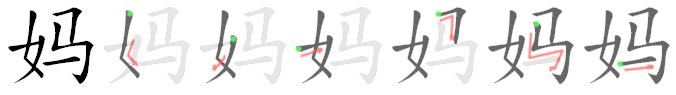 |
| 爸爸   | bà ba     | father                                  | 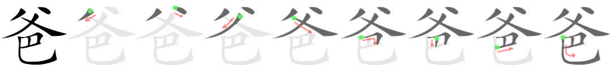 |
| 弟弟   | dì di     | younger brother                         | 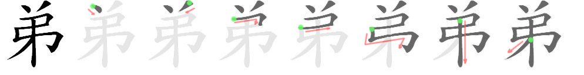 |
| 哥哥   | gē ge     | older brother                           | 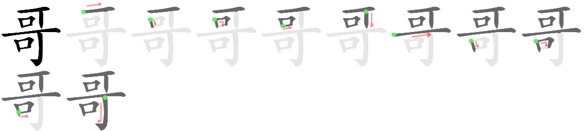 |
| 妹妹   | mèi mei   | younger sister                          | 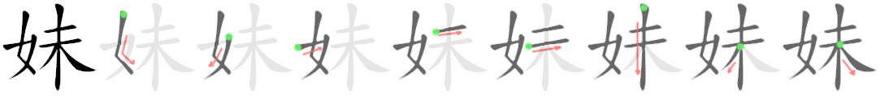 |
| 姐姐   | jiě jie   | older sister                            | 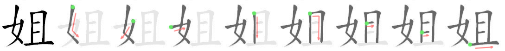 |
| 外     | wài       | outside, in addition, foreign, external | 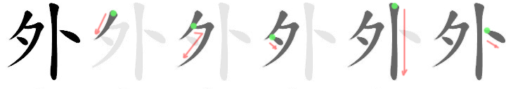 |
| 祖     | zǔ        | ancestor, forefather, grandparents      |                            |
| 父     | fù        | father                                  |  |
| 母     | mǔ        | mother                                  |                            |
| 爷爷   | yé ye     | paternal grandfather (informal)         | 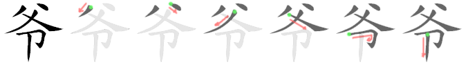 |
| 祖父   | zǔ fù     | paternal grandfather (formal)           |                            |
| 外公   | wài gōng  | maternal grandfather (informal)         |                            |
| 外祖父 | wài zǔ fù | maternal grandfather (formal)           |                            |
| 奶奶   | nǎi nai   | paternal grandmother (informal)         | 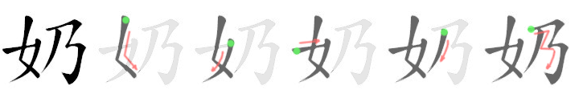 |
| 祖母   | zǔ mǔ     | paternal grandmother (formal)           |                            |
| 外婆   | wài pó    | maternal grandmother (informal)         |                            |
| 外祖母 | wài zǔ mǔ | maternal grandmother (formal)           |                            |

## Lesson 3 : 你叫什么名字

### 名字, 这

| 汉子 | 拼音    | 英文                                                    | Stroke order               |
| ---- | ------- | ------------------------------------------------------- | -------------------------- |
| 叫   | jiào    | to be called, to call, to order, to ask, to shout       | 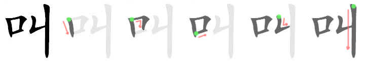 |
| 这   | zhè     | this, these                                             | 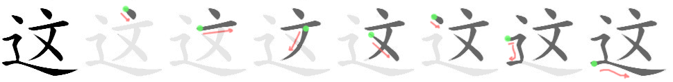 |
| 什   | shén    | what                                                    | 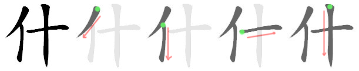 |
| 么   | me      | suffix, used to form interrogative                      | 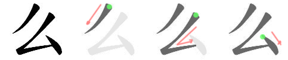 |
| 什么 | shén me | what ? who ? something, anything                        |                            |
| 名   | míng    | name, noun, place (rank), famous, classifier for people | 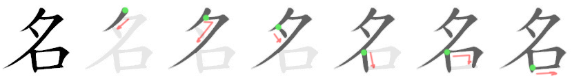 |
| 字   | zi      | letter, symbol, character, word                         | 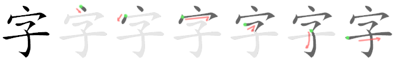 |
| 名字 | míng zi | name (of a person or thing)                             |                            |

- 你叫什么名字 ?
- 我叫雨果.
- 她叫什么名字 ?
- 她叫靖雯.
- 这是什么 ?
- 这是一本书.

### Occupation

| 汉子 | 拼音      | 英文                                                         | Stroke order               |
| ---- | --------- | ------------------------------------------------------------ | -------------------------- |
| 是   | shì       | to be, yes                                                   | 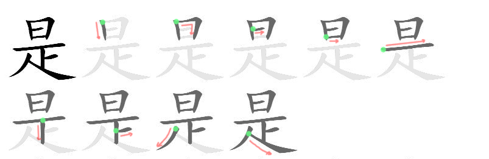 |
| 吗   | ma        | question particle for "yes-no" questions                     | 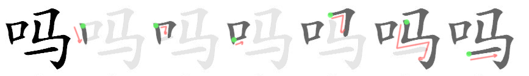 |
| 老   | lǎo       | prefix before the surname of a person, old, venerable, experienced | 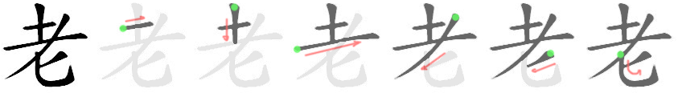 |
| 师   | shī       | teacher, master, expert, model                               | 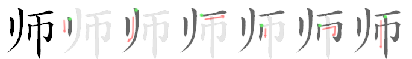 |
| 学   | xué       | to learn, to study, to imitate                               | 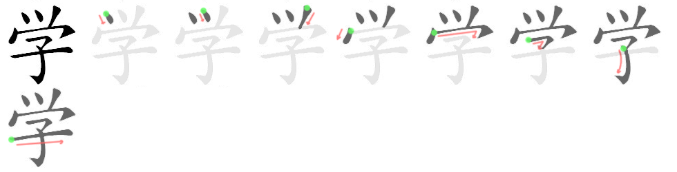 |
| 生   | shēng     | to be born, to givebirth, life, to grow, student             |  |
| 学生 | xué shēng | student, schoolchild                                         |                            |

- 你是老师吗 ? 
- 我不是老师, 我是学生.

### Nationality

| 汉子 | 拼音  | 英文                               | Stroke order               |
| ---- | ----- | ---------------------------------- | -------------------------- |
| 中   | zhōng | within, among, in, middle, center  | 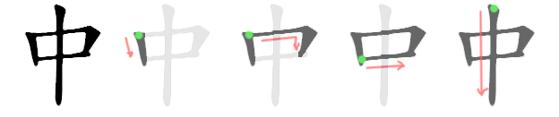 |
| 美   | měi   | beautiful, good, very satisfactory |                            |
| 法   | fǎ    | law, method, way                   | 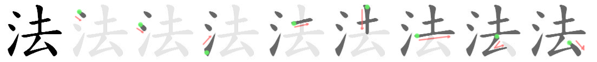 |
| 国   | guó   | country, nation, state             |  |
| 人   | rén   | man, person, people                |  |

- 你是中国人吗 ?
- 我不是中国人, 我是法国人.

## Lesson 4 : 她是我的汉语老师

### 的, 哪, 呢

| 汉子 | 拼音     | 英文                                                         | Stroke order               |
| ---- | -------- | ------------------------------------------------------------ | -------------------------- |
| 谁   | shéi     | who, whom                                                    |  |
| 的   | de       | ~'s (possessive particle), of, used after an attribute       |  |
| 哪   | nǎ       | how, which                                                   |  |
| 那   | nà       | that, those, then (in that case)                             |  |
| 呢   | ne       | particle indicating that a previously asked question is to be applied to the preceding word ("What about ...?", "And ...?") |  |
| 同   | tóng     | like, same, similar, together, alike                         |  |
| 同学 | tóng xué | fellow student, classmate                                    |                            |
| 朋   | péng     | friend                                                       |  |
| 友   | yǒu      | friend                                                       |  |
| 朋友 | péng you | friend                                                       |                            |

- 他是谁 ?
- 他是我的朋友.
- 你是哪国人 ?
- 我是英国人

### Language

| 汉子 | 拼音      | 英文                                                   | Stroke order               |
| ---- | --------- | ------------------------------------------------------ | -------------------------- |
| 谁   | shéi      | who, whom                                              |  |
| 的   | de        | ~'s (possessive particle), of, used after an attribute |  |
| 汉   | Hàn       | Han ethnic group                                       |  |
| 语   | yǔ        | language, dialect, speech                              |  |
| 汉语 | Hàn yǔ    | Han (chinese) language                                 |                            |
| 文   | wén       | language, culture, writing                             |  |
| 中文 | Zhōng wén | Chinese language                                       |                            |
| 法文 | Fǎ wén    | French language                                        |                            |

- 你的汉语老师叫什么 ?

## Lesson 5 :  她女儿今年二十岁

| 汉子 | 拼音  | 英文                               | Stroke order                                              |
| ---- | ----- | ---------------------------------- | --------------------------------------------------------- |
| 女   | nǚ    | female, woman                      |  |
| 儿   | ér    | son                                |  |
| 女儿 | nǚ ér | daughter                           |                                                           |
| 子   | zǐ    | son, child ,seed, egg, small thing |  |
| 儿子 | ér zi | son                                |                                                           |

### Counting people

| 汉子 | 拼音 | 英文                                    | Stroke order                                              |
| ---- | ---- | --------------------------------------- | --------------------------------------------------------- |
| 家   | jiā  | home, family                            |  |
| 有   | yǒu  | to have, there is, there are            |  |
| 几   | jǐ   | how much, how many (when 1 to 10)       |  |
| 口   | kǒu  | mouth, classifier for things with mouth |  |

- 你家有几口人 ?
- 我家有五口人.

### Age

| 汉子 | 拼音      | 英文                                                         | Stroke order                                              |
| ---- | --------- | ------------------------------------------------------------ | --------------------------------------------------------- |
| 多   | duō       | many, much, often, a lot of                                  |  |
| 大   | dà        | big, huge, large, major, older, very much                    |  |
| 多大 | duō dà    | how big, how much, how old (more than 10)                    |                                                           |
| 年   | nián      | year                                                         |  |
| 去   | qù        | to go, last, just passed                                     |  |
| 今   | jīn       | today, modern, present, current, now                         |  |
| 明   | míng      | bright, clean, next                                          |  |
| 去年 | qù nián   | last year                                                    |                                                           |
| 今年 | jīn nián  | this year                                                    |                                                           |
| 明年 | míng nián | next year                                                    |                                                           |
| 岁   | suì       | classifier for years (of age), year                          |  |
| 了   | le        | completed action market, modal particle intensifying preceding clause |  |

- 你英文老师多大了 ?
- 他今年五十六岁了.
- 他女儿几岁了 ? / 他女儿呢 ?
- 他女儿今年三岁了.