# HSK1

## Sources

- **HSK1 Standard Course**, Beijin language and culture university press, *Jiang Liping, Wang Fang, Wang Feng, Liu Liping*
- [Stroke Order Project](https://commons.wikimedia.org/wiki/Commons:Stroke_Order_Project), Images/animations under CC + GFDL, [M4RCo](https://commons.wikimedia.org/wiki/User:M4RC0)
- [Yabla](https://chinese.yabla.com)

## Lesson 9 : 你儿子在哪儿哪儿 ?

### 在哪儿 ? 在那儿

| 汉子 | 拼音 | 英文                                  | Stroke order               |
| ---- | ---- | ------------------------------------- | -------------------------- |
| 那   | nà   | that, those, then (in that case)      | 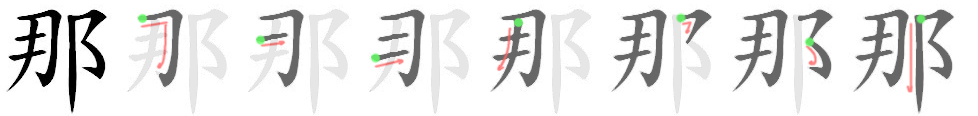 |
| 哪   | nǎ   | how, which                            | 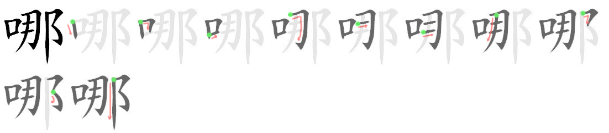 |
| 儿   | ér   | son                                   |  |
| 那儿 | nàr  | there                                 |                            |
| 哪儿 | nǎr  | where?                                |                            |
| 在   | zài  | (located) at, (to be) in/on, to exist | 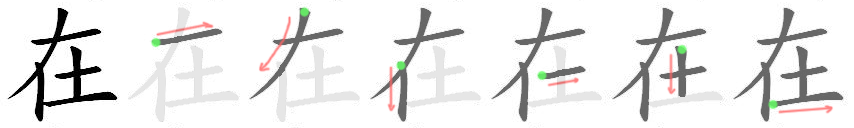 |

- 你爸爸在哪儿 ?
- 我爸爸不在家, 在工作.

### Animals

| 汉子 | 拼音 | 英文                                     | Stroke order               |
| ---- | ---- | ---------------------------------------- | -------------------------- |
| 只   | zhī  | classifier for birds and certain animals | 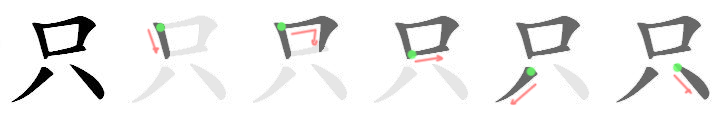 |
| 马   | mǎ   | horse                                    |                            |
| 猫   | māo  | cat                                      | 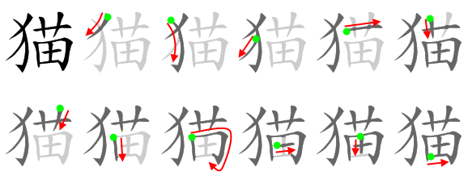 |
| 狗   | gǒu  | dog                                      | 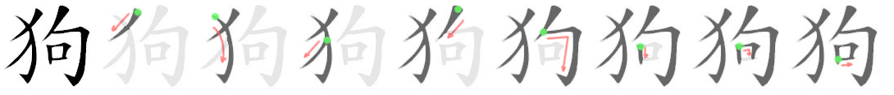 |

- 小猫在哪儿 ?

- 小猫在那.

### Work

| 汉子 | 拼音     | 英文                                             | Stroke order               |
| ---- | -------- | ------------------------------------------------ | -------------------------- |
| 工   | gōng     | work, worker, skill, profession                  | 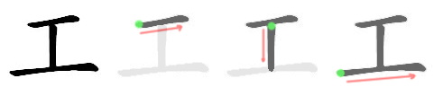 |
| 作   | zuò      | to do, to grow, to write or compose              | 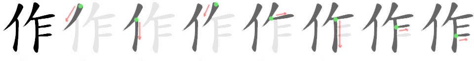 |
| 工作 | gōng zuò | to work, to operate, job, work, task             |                            |
| 工人 | gōng rén | worker                                           |                            |
| 医   | yī       | medical, medicine, doctor, to cure, to treat     | 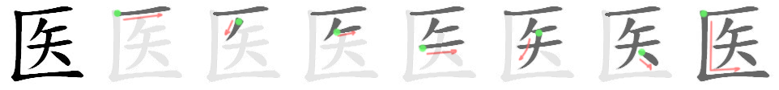 |
| 生   | shēng    | to be born, to givebirth, life, to grow, student | 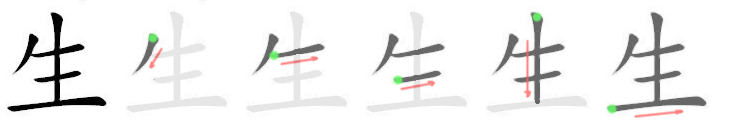 |
| 院   | yuàn     | courtyard, institution                           | 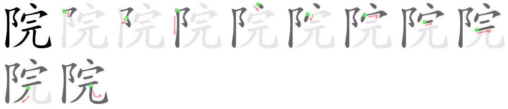 |
| 医生 | yī shēng | doctor                                           |                            |
| 医院 | yī yuàn  | hospital                                         |                            |

- 你儿子在哪儿工作 ?
- 我儿子在医院工作, 他是医生

## Lesson 10 : 我能坐这儿吗 ?

| 汉子 | 拼音    | 英文                                            | Stroke order               |
| ---- | ------- | ----------------------------------------------- | -------------------------- |
| 和   | hé      | and, together with, with, sum, union            | 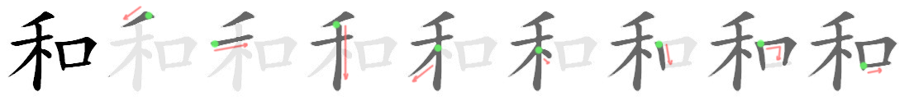   |
| 这儿 | zhèr    | here                                            |                            |
| 能   | néng    | can, to be able to                              | 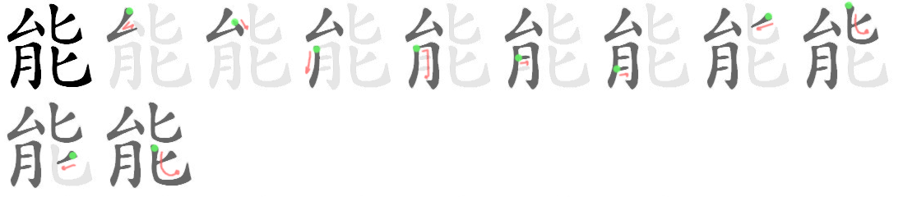 |
| 没有 | méi yǒu | haven't, has'nt, doesn't exist, to not have, no |                            |
| 坐   | zuò     | to sit, to take a seat                          | 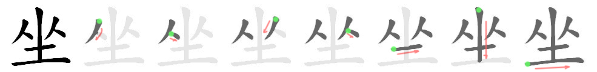 |

- 爸爸和妈妈
- 这儿有人吗 ?
- 没有.
- 我能坐这儿吗 ?
- 请坐.

### Objects

| 汉子 | 拼音      | 英文                                                         | Stroke order               |
| ---- | --------- | ------------------------------------------------------------ | -------------------------- |
| 椅   | yǐ        | chair                                                        |                            |
| 椅子 | yǐ zi     | chair                                                        |                            |
| 桌   | zhuō      | table, desk                                                  | 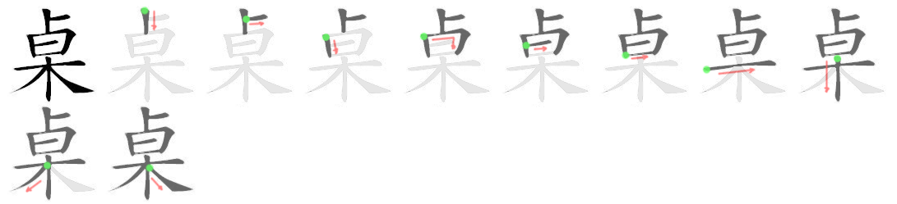 |
| 桌子 | zhuō zi   | table desk                                                   |                            |
| 杯   | bēi       | cup, classifier for certain containers of liquids            | 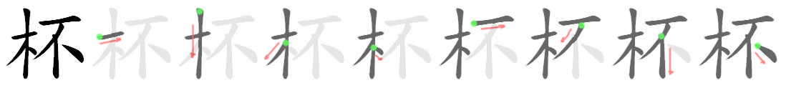 |
| 杯子 | bēi zi    | cup, glass                                                   |                            |
| 电   | diàn      | electric, electricity                                        | 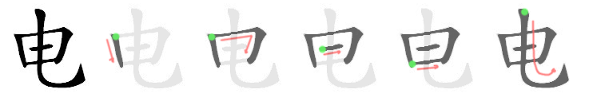 |
| 脑   | nǎo       | brain, mind, head                                            | 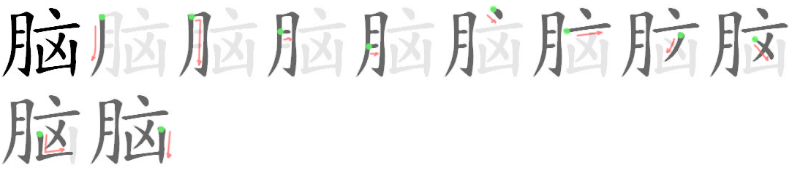 |
| 电脑 | diàn nǎo  | computer                                                     |                            |
| 话   | huà       | dialect, language, spoken words, speech, talk, words         | 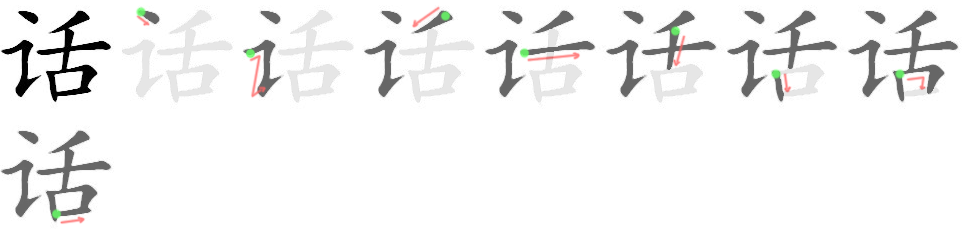 |
| 电话 | diàn huà  | telephone                                                    |                            |
| 影   | yǐng      | picture, image, film, movie, photograph                      |  |
| 电影 | diàn yǐng | movie, film                                                  |                            |
| 本   | běn       | roots or stem of plants, origin, source, foundation, classifier for books, files etc. |  |
| 书   | shū       | book, letter, document                                       | 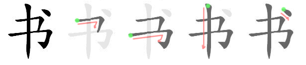 |

### Location

| 汉子 | 拼音       | 英文                                        | Stroke order               |
| ---- | ---------- | ------------------------------------------- | -------------------------- |
| 下   | xià        | down, below, lower, later, next, to go down | 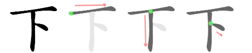 |
| 上   | shàng      | on top, upon, above, previous               |  |
| 前   | qián       | front, forward, ahead                       | 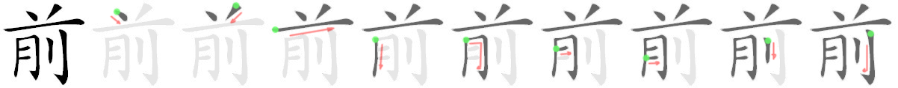 |
| 后   | hòu        | back, behind, rear, after                   | 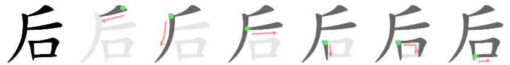 |
| 面   | miàn       | face, side, aspect, classifier for surfaces | 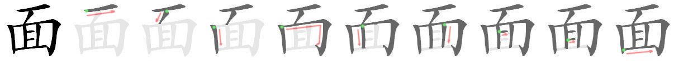 |
| 下面 | xià mian   | below, under                                |                            |
| 上面 | shàng mian | on top of                                   |                            |
| 前面 | qián miàn  | ahead, in front                             |                            |
| 后面 | hòu mian   | rear, back, behind, later                   |                            |
| 里   | lǐ         | lining, interior, inside, internal          | 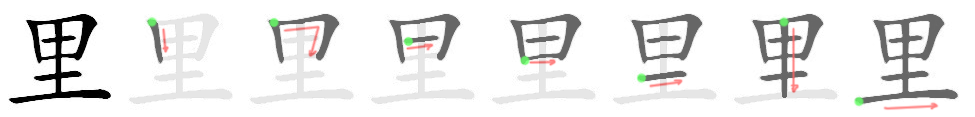 |

- 桌子上有什么 ?
- 桌子上有一个电脑和一本书.
- 被子在哪儿 ?
- 杯子在桌子里.
- 前面那个人叫什么名字 ?
- 他叫 ...

 ## Lesson 11 : 现在几点 ?

| 汉子 | 拼音 | 英文                                             | Stroke order               |
| ---- | ---- | ------------------------------------------------ | -------------------------- |
| 住   | zhù  | to live, to dwell, to stay, to reside            |  |
| 回   | huí  | to circle, to go back, to turn around, to return |  |

### Time

| 汉子 | 拼音     | 英文                                             | Stroke order               |
| ---- | -------- | ------------------------------------------------ | -------------------------- |
| 现   | xiàn     | to appear, present, now, current                 |  |
| 现在 | xiàn zài | now, at present, at the moment                   |                            |
| 点   | diǎn     | o'clock, point, dot, to check on a list          |  |
| 分   | fēn      | minute, part or subdivision, fraction, 0.01 yuan |  |
| 刻   | kè       | quarter (hour)                                   |  |
| 半   | bàn      | half, semi-, incomplete, and a half              |  |
| 时   | shí      | time, when, hour, season, period                 |  |
| 候   | hòu      | to wait, season, climate                         |  |
| 时候 | shí hou  | time, moment, period                             |                            |

- 现在几点 ?
- 现在十点三十分.
- 爸爸什么时候回家 ?
- 下午五点.
- 我们什么时候去看电影 ?
- 六点三十分

### Period of the day

| 汉子 | 拼音     | 英文                                        | Stroke order               |
| ---- | -------- | ------------------------------------------- | -------------------------- |
| 下   | xià      | down, below, lower, later, next, to go down |  |
| 上   | shàng    | on top, upon, above, previous               |  |
| 午   | wǔ       | noon                                        | 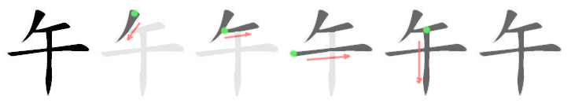 |
| 上午 | shàng wǔ | morning                                     |                            |
| 中午 | zhōng wǔ | noon, midday                                |                            |
| 下午 | xià wǔ   | afternoon                                   |                            |

- 下午你想做什么 ?
- 下午我想去商店.

## Lesson 12 : 明天天气怎么样 ?

| 汉子 | 拼音     | 英文                              | Stroke order             |
| ---- | -------- | --------------------------------- | ------------------------ |
| 来   | lái      | to come, to arrive, to come round |  |
| 小姐 | xiǎo jie | young lady, miss                  |                          |

### Weather

| 汉子      | 拼音        | 英文                                          | Stroke order               |
| --------- | ----------- | --------------------------------------------- | -------------------------- |
| 天气      | tiān qì     | weather                                       |                            |
| 样        | yàng        | manner, pattern, way, appearance              |  |
| 怎么样    | zěn me yàng | how ? how about ? how was it ?                |                            |
| 太        | tài         | highest, greatest, too (much) very, extremely |  |
| 太 ... 了 | tài ... le  | too ..., extremely ...                        |                            |
| 热        | rè          | hot, heat                                     |  |
| 冷        | lěng        | cold                                          |  |
| 雨        | yǔ          | rain                                          |  |
| 下雨      | xià yǔ      | to rain                                       |                            |

- 昨天北京的天气怎么样 ?
- 昨天天气很好, 不冷不热.
- 王小姐今天会来吗 ?
- 不会来, 天气太冷了.

### Sickness

| 汉子 | 拼音     | 英文                                  | Stroke order               |
| ---- | -------- | ------------------------------------- | -------------------------- |
| 身   | shēn     | body, life, oneself, personnally      |  |
| 体   | tǐ       | body, form, style,  system, substance |  |
| 身体 | shēntǐ   | the body, one's health                |                            |
| 爱   | ài       | to love, to be fond of, to like       |  |
| 多   | duō      | more, many,  much                     |  |
| 些   | xiē      | some, few, several                    |  |
| 少   | shǎo     | less, few                             |  |
| 水   | shuǐ     | water, river, liquid                  |  |
| 果   | guǒ      | fruit, result                         |  |
| 水果 | shuǐ guǒ | fruit                                 |                            |

- 你身体怎么样 ?
- 我身体不太好. 天气太热了, 不爱吃饭.
- 你多吃些水果, 多喝水.
- 谢谢你医生.

## Lesson 13 : 他在学做中国菜呢

| 汉子 | 拼音      | 英文                                                         | Stroke order               |
| ---- | --------- | ------------------------------------------------------------ | -------------------------- |
| 喂   | wèi       | hey, hello                                                   |                            |
| 也   | yě        | also, too                                                    |  |
| 习   | xí        | to practice, to study, habit                                 |  |
| 学习 | xué xí    | to learn, to study                                           |                            |
| 睡   | shuì      | to sleep, to lie down                                        |  |
| 觉   | jiào      | a nap, a sleep                                               |  |
| 睡觉 | shuì jiào | to go to bed, to sleep                                       |                            |
| 喜   | xǐ        | to be fond of, to like, to enjoy, to be happy, to feel pleased |  |
| 欢   | huān      | joyous, happy, pleased                                       |  |
| 喜欢 | xǐ huan   | to like, to be fond of                                       |                            |
| 吧   | ba        | modal particle indicating suggestion, request or command     |  |

- 你在做什么呢 ?
- 我在看书呢.

### Phone

| 汉子   | 拼音        | 英文                                                         | Stroke order               |
| ------ | ----------- | ------------------------------------------------------------ | -------------------------- |
| 打     | dǎ          | to make, to beat, to strike, to hit, to break, to type, to build, to issue |  |
| 电     | diàn        | electric, electricity                                        |  |
| 话     | huà         | dialect, language, spoken words, speech, talk, words         |    |
| 电话   | diàn huà    | telephone                                                    |                            |
| 打电话 | dǎ diàn huà | to make a phone call                                         |                            |
| 给     | gěi         | to, for, to the benefit of, to give, to allow                |  |
| 号码   | hào mǎ      | number (telephone)                                           |                            |

- 我现在给他打电话

## Lesson 14 : 他买了不少衣服

### Shopping

| 汉子 | 拼音     | 英文                 | Stroke order               |
| ---- | -------- | -------------------- | -------------------------- |
| 东   | dōng     | east                 |  |
| 西   | xī       | west                 |                            |
| 东西 | dōng xi  | thing, stuff, person |                            |
| 苹果 | píng guǒ | apple                | 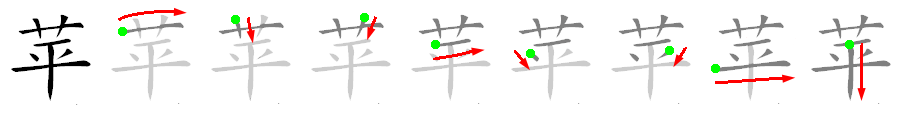 |

- 我去商店买东西了
- 你买什么了 ?
- 我买了一点儿苹果

### Driving

| 汉子 | 拼音     | 英文                                    | Stroke order               |
| ---- | -------- | --------------------------------------- | -------------------------- |
| 开   | kāi      | to open, to start, to turn on, to drive | 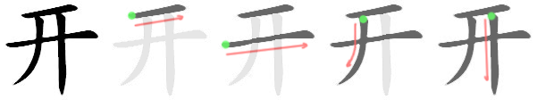 |
| 车   | chē      | car, vehicule                           | 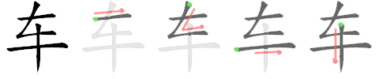 |
| 看见 | kàn jiàn | to see                                  |                            |
| 先生 |          |                                         |                            |

